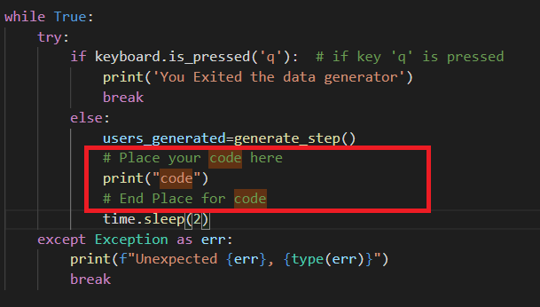

# Welcome to DataGenerator!

Para este primer Data Project, yo seré vuestro generador de datos de personas para ambos casos de uso:

# Modo de empleo

1) Clonaros el repo
2) Instalar las librerias usando el pip: 
<code>pip install -r requirements.txt</code>
3) Ejecutar el código 
<code>python datagenerator.py</code>

## Modificación

El script datagenerator debe ser modificado para encajar en vuestra arquitectura de datos. Es decir, enviar los datos a donde los recibirá vuestro sistema (Cola de mensajes, Ingestion, ETL, BBDD...).
Para ello solo podéis modificar la parte remarcada a continuación:

